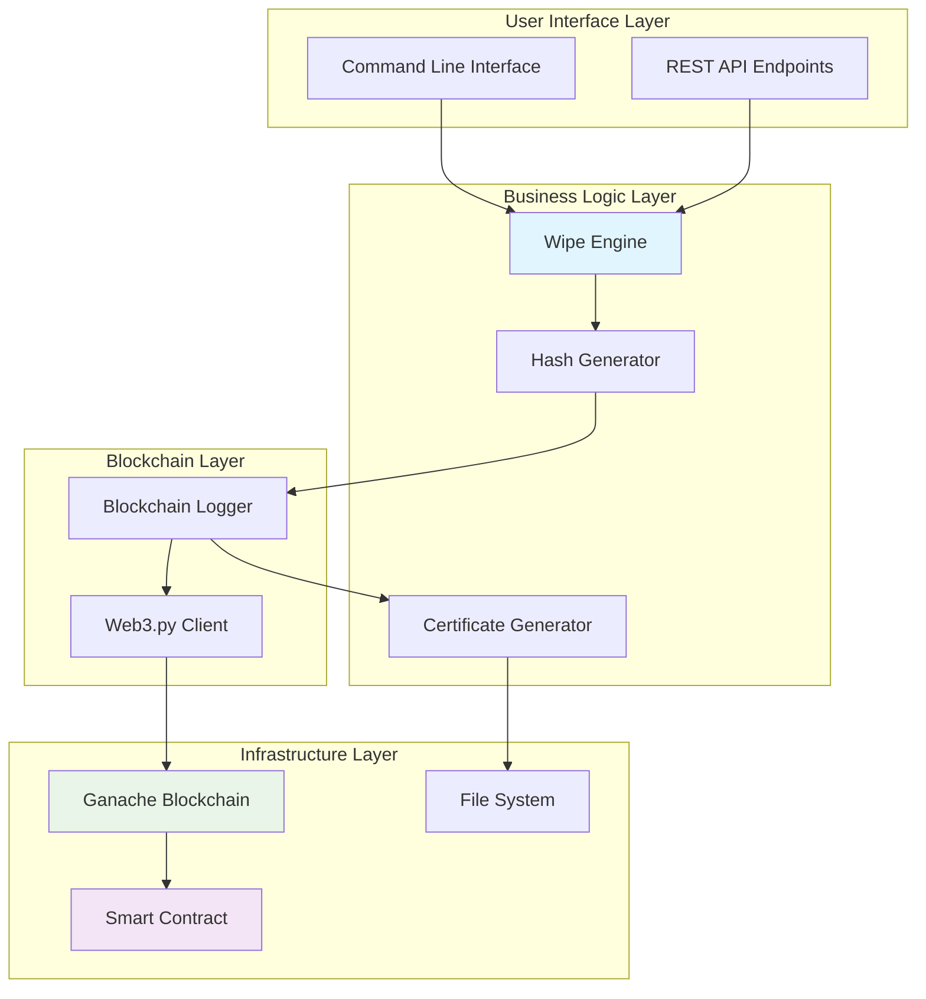

# Design Document: Secure Data Wiping with Blockchain Audit Trail

## Overview

The Secure Data Wiping system implements a comprehensive solution for trustworthy IT asset recycling through cryptographically verifiable data destruction. The system combines NIST 800-88 compliant data wiping procedures with blockchain-based immutable audit trails, providing legally defensible proof of secure data destruction.

The architecture follows a modular design with five core components: the Wipe Engine for secure data destruction, Hash Generator for cryptographic verification, Blockchain Logger for immutable audit records, Smart Contract for decentralized storage, and Certificate Generator for official documentation.

## Architecture

The system employs a layered architecture that ensures security, auditability, and compliance:



### Component Interaction Flow

1. **Initiation**: User initiates wiping operation via CLI or API
2. **Wiping**: Wipe Engine executes NIST 800-88 compliant data destruction
3. **Hashing**: Hash Generator creates SHA-256 proof of wiping operation
4. **Blockchain Logging**: Blockchain Logger stores hash on local Ethereum blockchain
5. **Certificate Generation**: Certificate Generator creates PDF with blockchain verification
6. **Verification**: System provides tools for independent verification of certificates

## Components and Interfaces

### Wipe Engine (`wipe_engine.py`)

The Wipe Engine implements secure data destruction following NIST 800-88 guidelines.

**Core Classes:**
```python
class WipeEngine:
    def __init__(self, config: WipeConfig)
    def wipe_device(self, device_path: str, method: WipeMethod) -> WipeResult
    def verify_wipe(self, device_path: str) -> bool
    
class WipeMethod(Enum):
    NIST_CLEAR = "clear"
    NIST_PURGE = "purge" 
    NIST_DESTROY = "destroy"
    
class WipeResult:
    device_id: str
    method: WipeMethod
    passes: int
    start_time: datetime
    end_time: datetime
    success: bool
    verification_hash: str
```

**Key Methods:**
- `wipe_device()`: Executes multi-pass overwriting based on NIST standards
- `verify_wipe()`: Performs post-wipe verification to ensure data destruction
- `generate_wipe_metadata()`: Creates structured metadata for hashing

### Hash Generator (`hash_generator.py`)

Generates cryptographic proofs of wiping operations using SHA-256.

**Core Classes:**
```python
class HashGenerator:
    def __init__(self, algorithm: str = "sha256")
    def generate_wipe_hash(self, wipe_result: WipeResult) -> str
    def verify_hash(self, wipe_result: WipeResult, expected_hash: str) -> bool
    
class HashData:
    device_id: str
    timestamp: str
    method: str
    passes: int
    operator: str
    verification_data: str
```

**Hash Composition:**
The system generates deterministic hashes from:
- Device identifier (serial number, model)
- Wiping method and parameters
- Timestamp (ISO 8601 format)
- Operator identification
- Verification checksums

### Blockchain Logger (`blockchain_logger.py`)

Manages interaction with the local Ethereum blockchain for audit trail storage.

**Core Classes:**
```python
class BlockchainLogger:
    def __init__(self, web3_provider: str, contract_address: str, abi: dict)
    def connect_to_ganache(self) -> bool
    def record_wipe(self, device_id: str, wipe_hash: str) -> str
    def get_wipe_record(self, device_id: str) -> WipeRecord
    def verify_transaction(self, tx_hash: str) -> bool
    
class WipeRecord:
    device_id: str
    wipe_hash: str
    timestamp: int
    operator_address: str
    transaction_hash: str
    block_number: int
```

**Blockchain Integration:**
- Connects to Ganache via Web3.py
- Handles transaction signing and gas management
- Implements retry logic for failed transactions
- Provides transaction receipt verification

### Smart Contract (`WipeAuditContract.sol`)

Solidity smart contract for immutable audit record storage.

**Contract Structure:**
```solidity
pragma solidity ^0.8.0;

contract WipeAuditContract {
    struct WipeRecord {
        string deviceId;
        bytes32 wipeHash;
        uint256 timestamp;
        address operator;
        bool exists;
    }
    
    mapping(string => WipeRecord) private wipeRecords;
    mapping(string => bool) private deviceExists;
    
    event WipeRecorded(
        string indexed deviceId,
        bytes32 wipeHash,
        uint256 timestamp,
        address operator
    );
    
    function recordWipe(string memory deviceId, bytes32 wipeHash) public;
    function getWipeRecord(string memory deviceId) public view returns (WipeRecord memory);
    function verifyWipe(string memory deviceId, bytes32 expectedHash) public view returns (bool);
}
```

**Security Features:**
- Immutable record storage
- Event emission for external monitoring
- Access control for authorized operators
- Hash verification functions

### Certificate Generator (`certificate_generator.py`)

Creates professional PDF certificates with blockchain verification.

**Core Classes:**
```python
class CertificateGenerator:
    def __init__(self, template_config: dict)
    def generate_certificate(self, wipe_data: WipeData, blockchain_data: BlockchainData) -> str
    def add_qr_verification(self, certificate: Canvas, verification_url: str)
    def add_security_features(self, certificate: Canvas)
    
class WipeData:
    device_id: str
    wipe_hash: str
    timestamp: datetime
    method: str
    operator: str
    
class BlockchainData:
    transaction_hash: str
    block_number: int
    contract_address: str
    gas_used: int
```

**Certificate Features:**
- Professional PDF layout using reportlab
- QR codes for blockchain verification
- Digital signatures and security watermarks
- Compliance with industry documentation standards

## Data Models

### Core Data Structures

**Device Information:**
```python
@dataclass
class DeviceInfo:
    device_id: str          # Unique identifier (serial number)
    device_type: str        # HDD, SSD, USB, etc.
    capacity: int           # Storage capacity in bytes
    manufacturer: str       # Device manufacturer
    model: str             # Device model
    serial_number: str     # Hardware serial number
    connection_type: str   # SATA, USB, NVMe, etc.
```

**Wipe Operation:**
```python
@dataclass
class WipeOperation:
    operation_id: str      # UUID for operation tracking
    device_info: DeviceInfo
    wipe_method: WipeMethod
    start_time: datetime
    end_time: datetime
    passes_completed: int
    success: bool
    error_message: str
    verification_hash: str
    operator_id: str
```

**Blockchain Record:**
```python
@dataclass
class BlockchainRecord:
    device_id: str
    wipe_hash: bytes
    timestamp: int
    operator_address: str
    transaction_hash: str
    block_number: int
    gas_used: int
    confirmation_count: int
```

### Database Schema (SQLite for Local Storage)

```sql
CREATE TABLE wipe_operations (
    id INTEGER PRIMARY KEY AUTOINCREMENT,
    operation_id TEXT UNIQUE NOT NULL,
    device_id TEXT NOT NULL,
    device_type TEXT NOT NULL,
    wipe_method TEXT NOT NULL,
    start_time TIMESTAMP NOT NULL,
    end_time TIMESTAMP,
    success BOOLEAN NOT NULL,
    wipe_hash TEXT,
    transaction_hash TEXT,
    created_at TIMESTAMP DEFAULT CURRENT_TIMESTAMP
);

CREATE TABLE blockchain_records (
    id INTEGER PRIMARY KEY AUTOINCREMENT,
    device_id TEXT NOT NULL,
    transaction_hash TEXT UNIQUE NOT NULL,
    block_number INTEGER NOT NULL,
    gas_used INTEGER NOT NULL,
    confirmation_count INTEGER DEFAULT 0,
    created_at TIMESTAMP DEFAULT CURRENT_TIMESTAMP
);

CREATE TABLE certificates (
    id INTEGER PRIMARY KEY AUTOINCREMENT,
    operation_id TEXT NOT NULL,
    certificate_path TEXT NOT NULL,
    generated_at TIMESTAMP DEFAULT CURRENT_TIMESTAMP,
    FOREIGN KEY (operation_id) REFERENCES wipe_operations(operation_id)
);
```

## Correctness Properties

*A property is a characteristic or behavior that should hold true across all valid executions of a system—essentially, a formal statement about what the system should do. Properties serve as the bridge between human-readable specifications and machine-verifiable correctness guarantees.*

### Property 1: NIST Compliance for Wiping Operations
*For any* wiping operation on any supported device type, the system should implement NIST 800-88 compliant procedures with the correct number of passes for the specified method
**Validates: Requirements 1.1, 1.2, 1.5**

### Property 2: Hash Generation Completeness and Determinism  
*For any* completed wiping operation, the system should generate a SHA-256 hash that includes device identifier, timestamp, and wiping parameters, and identical operations should always produce identical hashes
**Validates: Requirements 2.1, 2.2, 2.4**

### Property 3: Tamper Detection Through Hash Verification
*For any* wiping operation data, if the data is modified after hash generation, the system should detect the tampering through hash comparison
**Validates: Requirements 2.5**

### Property 4: Blockchain Recording for Completed Operations
*For any* successfully completed wiping operation, the system should create an immutable blockchain record with timestamp that can be retrieved by device ID or transaction hash
**Validates: Requirements 3.1, 3.2, 3.3**

### Property 5: Local Blockchain Connectivity Restriction
*For any* blockchain connection attempt, the system should only connect to local Ganache instances and reject connections to external networks
**Validates: Requirements 3.4, 7.2**

### Property 6: Blockchain Operation Retry Logic
*For any* failed blockchain operation, the system should retry exactly 3 times before reporting failure
**Validates: Requirements 3.5**

### Property 7: Smart Contract Event Emission
*For any* wipe record stored in the smart contract, the system should emit a WipeRecorded event containing all required fields (deviceId, wipeHash, timestamp, transaction hash)
**Validates: Requirements 4.4**

### Property 8: Smart Contract Access Control
*For any* unauthorized address attempting to modify existing wipe records, the smart contract should prevent the modification
**Validates: Requirements 4.7**

### Property 9: Certificate Generation for Successful Operations
*For any* wiping operation that completes successfully with blockchain logging, the system should generate a PDF certificate containing device ID, wiping hash, blockchain transaction ID, and timestamp
**Validates: Requirements 5.1, 5.2**

### Property 10: QR Code Verification Links
*For any* generated certificate, the system should include a valid QR code that links to blockchain verification functionality
**Validates: Requirements 5.4**

### Property 11: Error Handling and Process Termination
*For any* step in the wiping process that fails (wiping, hashing, blockchain logging, or certificate generation), the system should halt processing, log the error, and prevent subsequent steps from executing
**Validates: Requirements 1.4, 2.3, 5.5, 6.3**

### Property 12: Sequential Process Execution
*For any* asset processing operation, the system should execute wiping, hashing, blockchain logging, and certificate generation in the correct sequential order
**Validates: Requirements 6.2**

### Property 13: Comprehensive Operation Logging
*For any* system operation, the system should maintain detailed logs for troubleshooting and audit purposes, and provide summary reports upon completion
**Validates: Requirements 6.4, 6.5**

### Property 14: Local Infrastructure Operation
*For any* system operation, the system should function correctly without internet connectivity and store all data, logs, and certificates on local file systems
**Validates: Requirements 7.1, 7.3**

### Property 15: Offline Certificate Verification
*For any* generated certificate, the system should provide offline verification capabilities that work without network access
**Validates: Requirements 7.5**

### Property 16: Data Privacy Protection
*For any* blockchain record, certificate, or log entry, the system should store only cryptographic hashes and non-sensitive metadata, never actual recovered data or sensitive information
**Validates: Requirements 8.1, 8.2, 8.3, 8.5**

### Property 17: Batch Processing Capability
*For any* set of multiple IT assets provided via command-line interface, the system should process each asset through the complete wiping workflow
**Validates: Requirements 9.10**

### Property 18: Code Documentation Completeness
*For any* class or function in the system, the code should include comprehensive docstrings for documentation purposes
**Validates: Requirements 10.2**

## Error Handling

The system implements comprehensive error handling across all components to ensure reliability and security:

### Wipe Engine Error Handling
- **Device Access Errors**: Handle permission issues, device not found, or hardware failures
- **Wiping Process Errors**: Detect incomplete wipes, verification failures, or hardware malfunctions
- **Recovery Procedures**: Implement safe rollback for partial operations

### Hash Generation Error Handling
- **Input Validation**: Verify all required metadata is present before hash generation
- **Cryptographic Errors**: Handle SHA-256 computation failures or invalid input data
- **Determinism Verification**: Ensure hash reproducibility across multiple attempts

### Blockchain Integration Error Handling
- **Connection Failures**: Implement retry logic with exponential backoff for Ganache connectivity
- **Transaction Failures**: Handle gas estimation errors, transaction timeouts, and network issues
- **Smart Contract Errors**: Manage contract deployment failures and function call exceptions
- **Data Consistency**: Ensure blockchain state consistency through transaction verification

### Certificate Generation Error Handling
- **PDF Creation Errors**: Handle reportlab failures, file system issues, and formatting problems
- **QR Code Generation**: Manage QR code creation failures and verification link validation
- **Template Processing**: Handle missing templates or configuration errors

### System-Level Error Handling
- **Graceful Degradation**: Continue operation when non-critical components fail
- **Error Propagation**: Ensure errors are properly logged and reported to operators
- **State Recovery**: Implement checkpointing for long-running operations
- **Audit Trail Integrity**: Maintain error logs for compliance and debugging

## Testing Strategy

The system employs a dual testing approach combining unit tests for specific scenarios and property-based tests for comprehensive verification:

### Unit Testing Approach
Unit tests focus on specific examples, edge cases, and integration points:

- **Component Testing**: Test individual classes and functions with known inputs
- **Integration Testing**: Verify component interactions and data flow
- **Edge Case Testing**: Handle boundary conditions, empty inputs, and error scenarios
- **Mock Testing**: Use mocked blockchain and file system for isolated testing

**Key Unit Test Areas:**
- NIST wiping method implementations with specific device types
- SHA-256 hash generation with known test vectors
- Smart contract deployment and function calls
- PDF certificate generation with sample data
- Error handling scenarios with simulated failures

### Property-Based Testing Approach
Property-based tests verify universal properties across randomized inputs:

- **Test Framework**: Use Hypothesis for Python property-based testing
- **Test Configuration**: Minimum 100 iterations per property test
- **Input Generation**: Smart generators for device configurations, wipe parameters, and blockchain data
- **Property Verification**: Each correctness property implemented as a separate test

**Property Test Implementation:**
```python
# Example property test structure
@given(device_config=device_strategy(), wipe_method=wipe_method_strategy())
def test_nist_compliance_property(device_config, wipe_method):
    """Feature: secure-data-wiping-blockchain, Property 1: NIST Compliance for Wiping Operations"""
    result = wipe_engine.wipe_device(device_config, wipe_method)
    assert result.passes >= nist_required_passes(wipe_method)
    assert result.method == wipe_method
    assert result.success == True
```

**Test Data Generators:**
- Device configurations (various types, capacities, manufacturers)
- Wiping parameters (methods, pass counts, verification settings)
- Blockchain scenarios (successful transactions, failures, network issues)
- Certificate data (various device combinations and metadata)

### Testing Infrastructure
- **Local Ganache Setup**: Automated blockchain setup for testing
- **Test Data Management**: Reproducible test datasets and configurations
- **Continuous Integration**: Automated test execution on code changes
- **Performance Testing**: Measure wiping times and blockchain transaction costs
- **Security Testing**: Verify cryptographic implementations and access controls

### Test Coverage Requirements
- **Unit Test Coverage**: Minimum 90% code coverage for all components
- **Property Test Coverage**: All 18 correctness properties implemented as tests
- **Integration Coverage**: End-to-end workflows from wiping to certificate generation
- **Error Path Coverage**: All error handling paths tested with appropriate scenarios

The testing strategy ensures both correctness verification through properties and practical validation through specific examples, providing comprehensive confidence in system reliability and security.